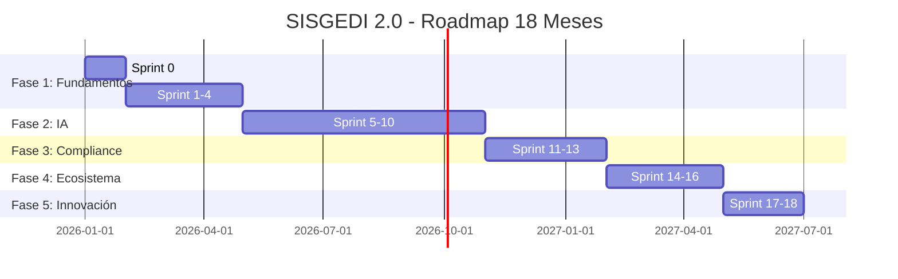

# 🗺️ ROADMAP DE DESARROLLO SISGEDI 2.0
## Plan Maestro de Implementación (18 Meses)

**Fecha Inicio:** Enero 2026
**Fecha Finalización:** Junio 2027
**Inversión Total:** $676,600 USD
**ROI Proyectado:** 168% a 3 años

---

## 📊 ESTRUCTURA DEL ROADMAP



---

## 🎯 FASE 1: FUNDAMENTOS SÓLIDOS (Meses 1-4)
**Objetivo:** Construir base compliance-first con funcionalidades core
**Inversión:** $141,200 USD
**Team:** 5 personas (Tech Lead, 2 Full-Stack, DevOps, QA)

### **SPRINT 0: Setup del Proyecto (Mes 1)**

#### Semana 1-2: Infraestructura
- [ ] **Supabase Setup**
  - Proyecto creado en Supabase Cloud
  - PostgreSQL 15 configurado
  - Row Level Security habilitado
  - Backup automático configurado (PITR)

- [ ] **GitHub Repository**
  - Monorepo estructura definida
  - Branch protection rules (main, develop, staging)
  - GitHub Actions CI/CD pipeline
  - Secrets management (Supabase, Google Cloud)

- [ ] **Ambiente de Desarrollo**
  - Docker compose para desarrollo local
  - VSCode settings compartidos
  - ESLint + Prettier + Husky pre-commit hooks
  - TypeScript strict mode

#### Semana 3-4: Arquitectura Base
- [ ] **Database Schema v1.0**
  ```sql
  -- Core tables (desde database_schema.sql)
  - usuarios (con RLS policies)
  - dependencias
  - documentos (con vector embeddings)
  - flujo_trabajo
  - auditoria (immutable)
  ```

- [ ] **Authentication (Supabase Auth)**
  - Email/Password login
  - OAuth providers (Google, Microsoft)
  - MFA habilitado (TOTP)
  - Session management (JWT)

- [ ] **Next.js 14 App Setup**
  ```
  /apps
    /web (Next.js 14 + App Router)
      /app
        /(auth)
        /(dashboard)
        /api
      /components
        /ui (shadcn/ui)
        /features
      /lib
        /supabase
        /actions
  ```

#### Entregables Sprint 0:
✅ Ambiente local funcionando
✅ CI/CD desplegando a staging
✅ Schema de BD con 20 tablas core
✅ Login funcional con MFA
✅ Dashboard vacío desplegado

**Costo Sprint 0:** $35,300

---

### **SPRINT 1-2: Gestión Documental Core (Meses 2-3)**

#### Funcionalidades Implementadas:

**1. Captura de Documentos (ISO 15489 A3.1)**
- [ ] Upload de archivos (drag & drop)
  - Formatos: PDF, DOCX, XLSX, JPG, PNG
  - Max size: 100MB
  - Validación de tipos MIME
  - Virus scanning (ClamAV)

- [ ] Metadatos automáticos (ISO 15489 A2.1)
  ```typescript
  interface DocumentMetadata {
    // Metadatos esenciales
    titulo: string
    fecha_creacion: timestamp
    autor: string
    tipo_documento: string

    // Metadatos de contexto
    dependencia_origen: string
    proceso_negocio: string
    expediente_id?: string

    // Metadatos de gestión
    clasificacion_seguridad: 'publico' | 'interno' | 'confidencial'
    periodo_retencion: number // años
    fecha_disposicion: timestamp

    // Metadatos técnicos
    hash_sha256: string
    formato_archivo: string
    tamano_bytes: number
    version: number
  }
  ```

- [ ] Clasificación documental
  - Árbol de series documentales
  - Cuadro de clasificación documental (CCD)
  - Asignación automática basada en tipo

**2. Almacenamiento Seguro**
- [ ] Supabase Storage buckets
  - Bucket público (thumbnails)
  - Bucket privado (documentos originales)
  - RLS policies por dependencia

- [ ] Versionado de documentos
  - Inmutabilidad del original
  - Historial de versiones
  - Diff visual entre versiones

- [ ] Backup automático
  - Snapshot diario en Google Cloud Storage
  - Retención 90 días

**3. Búsqueda Básica**
- [ ] Full-text search (PostgreSQL tsvector)
  - Español (simple dictionary)
  - Búsqueda por metadatos
  - Filtros por fecha, tipo, dependencia

- [ ] Resultados paginados
  - 20 resultados por página
  - Faceted search (filtros laterales)

**4. Visualización de Documentos**
- [ ] PDF Viewer (PDF.js)
- [ ] Office files preview (Office Online)
- [ ] Image viewer con zoom
- [ ] Responsive mobile view

#### Entregables Sprint 1-2:
✅ Usuario puede subir PDF y verlo
✅ Metadatos capturados automáticamente
✅ Búsqueda por texto funcional
✅ RLS implementado (usuario solo ve sus docs)
✅ Tests E2E con Playwright (10 escenarios)

**Costo Sprint 1-2:** $52,900

---

### **SPRINT 3-4: Workflows y Tramitación (Meses 3-4)**

#### Funcionalidades Implementadas:

**1. Motor de Workflows (BPMN 2.0 D1)**
- [ ] Modelado visual de workflows
  - Integration con Camunda BPMN Modeler
  - Elementos soportados:
    - Start/End events
    - User tasks
    - Service tasks
    - Exclusive gateways
    - Parallel gateways

- [ ] Ejecución de workflows
  ```typescript
  interface WorkflowExecution {
    workflow_id: string
    documento_id: string
    estado_actual: 'iniciado' | 'en_proceso' | 'completado' | 'cancelado'
    tareas_completadas: Task[]
    tareas_pendientes: Task[]
    fecha_inicio: timestamp
    fecha_limite: timestamp
    sla_status: 'on_time' | 'at_risk' | 'overdue'
  }
  ```

**2. Sistema de Turnado**
- [ ] Bandeja de entrada personalizada
  - Filtros: prioridad, fecha, dependencia
  - Ordenamiento inteligente
  - Vista kanban / lista

- [ ] Asignación de tareas
  - Manual (seleccionar usuario)
  - Automática (round-robin)
  - Basada en reglas (carga de trabajo)

- [ ] Notificaciones
  - Email (SendGrid)
  - In-app notifications
  - Push notifications (PWA)

**3. Tracking de SLA**
- [ ] Definición de SLA por tipo de trámite
  ```typescript
  interface SLA {
    tipo_tramite: string
    tiempo_respuesta_horas: number
    escalamiento_nivel_1: number // % del tiempo
    escalamiento_nivel_2: number
    notificaciones_recordatorio: number[] // horas antes
  }
  ```

- [ ] Alertas automáticas
  - 80% del tiempo → amarillo
  - 100% del tiempo → rojo + notificación jefe

- [ ] Dashboard de SLA compliance
  - Por dependencia
  - Por tipo de trámite
  - Histórico mensual

**4. Firmas Digitales (CFDI/e.firma compatible)**
- [ ] Integración con FIEL (México)
- [ ] Validación de certificados
- [ ] Timestamp notarization (TSA)
- [ ] Cadena de custodia

#### Entregables Sprint 3-4:
✅ Workflow básico funcionando (3 pasos)
✅ Usuario puede turnar documento
✅ SLA tracking con alertas
✅ Firma digital básica
✅ Dashboard de tramitación

**Costo Sprint 3-4:** $53,000

---

## 🤖 FASE 2: INTELIGENCIA ARTIFICIAL (Meses 5-10)
**Objetivo:** Automatizar 60% de tareas manuales con IA
**Inversión:** $162,400 USD
**Team:** +2 ML Engineers, +1 Data Engineer

### **SPRINT 5-6: OCR y Document Understanding (Meses 5-6)**

#### Funcionalidades Implementadas:

**1. OCR Avanzado (Google Document AI) - E1.1**
- [ ] Setup Google Cloud Project
  - Document AI API habilitada
  - Service account configurado
  - Budget alerts ($500/mes)

- [ ] OCR Pipeline
  ```typescript
  interface OCRResult {
    texto_extraido: string
    confianza_promedio: number // target: 98%+
    entidades_detectadas: Entity[]
    tablas: Table[]
    layout: PageLayout[]
    idioma_detectado: string[]
  }
  ```

- [ ] Tipos de documentos soportados:
  - Contratos
  - Facturas
  - Actas
  - Oficios
  - Formularios
  - Identificaciones oficiales

- [ ] Post-procesamiento
  - Corrección ortográfica
  - Normalización de fechas/números
  - Validación de consistencia

**2. Extracción Inteligente de Datos (E1.4)**
- [ ] Form auto-fill
  - Detectar campos en PDFs escaneados
  - Pre-llenar formulario digital
  - Validación contra catálogos

- [ ] Table extraction
  - Convertir tablas a CSV/Excel
  - Preservar estructura
  - OCR de celdas individuales

**3. Handwriting Recognition (E1.2)**
- [ ] Google Cloud Vision Handwriting API
- [ ] Soporte para manuscritos en español
- [ ] Confianza mínima: 85%

#### Entregables Sprint 5-6:
✅ PDF escaneado → texto editable (98% accuracy)
✅ Formularios auto-completados
✅ Tablas extraídas a Excel
✅ Soporte para manuscritos
✅ Dashboard de accuracy metrics

**Costo Sprint 5-6:** $54,100

---

### **SPRINT 7-8: NLP y Análisis de Contenido (Meses 7-8)**

#### Funcionalidades Implementadas:

**1. NLP Pipeline (OpenAI GPT-4o) - E2**
- [ ] Resumen automático (E2.1)
  ```typescript
  interface DocumentSummary {
    resumen_ejecutivo: string // 3-5 oraciones
    resumen_detallado: string // 1-2 párrafos
    puntos_clave: string[] // bullet points
    tiempo_ahorro: number // 30% promedio
  }
  ```

- [ ] Extracción de entidades (E2.2)
  - Personas
  - Organizaciones
  - Fechas
  - Montos
  - Ubicaciones
  - Referencias legales (artículos, leyes)

- [ ] Sentiment analysis (E2.3)
  - Clasificación: positivo/neutral/negativo
  - Score: -1 a +1
  - Casos de uso: quejas ciudadanas, evaluaciones

**2. Clasificación Automática (E3.2)**
- [ ] ML Model Training
  - Dataset: 10,000 documentos etiquetados
  - Model: Fine-tuned BERT español
  - Accuracy target: 95%+

- [ ] Auto-tagging
  - Predicción de tipo de documento
  - Sugerencia de serie documental
  - Asignación de metadata

**3. Question Answering (RAG) - E2.5**
- [ ] Vector embeddings (OpenAI text-embedding-3-large)
  - Stored en pgvector (Supabase)
  - Dimensiones: 3072

- [ ] RAG Implementation
  ```typescript
  interface RAGQuery {
    pregunta: string
    contexto_documentos: string[] // IDs de docs relevantes
    respuesta: string
    fuentes: DocumentReference[]
    confianza: number
  }
  ```

- [ ] Casos de uso:
  - "¿Qué dice el contrato sobre penalizaciones?"
  - "¿Cuándo vence el plazo para responder?"
  - "¿Quién firmó este acuerdo?"

#### Entregables Sprint 7-8:
✅ Resumen automático de documentos
✅ Extracción de entidades con 95% accuracy
✅ RAG respondiendo preguntas
✅ Clasificación automática funcionando
✅ Vector search implementado

**Costo Sprint 7-8:** $54,150

---

### **SPRINT 9-10: ML Predictivo (Meses 9-10)**

#### Funcionalidades Implementadas:

**1. Turnado Predictivo (E3.1) - 🏆 DIFERENCIADOR**
- [ ] Dataset de entrenamiento
  - Histórico de 50,000 turnados
  - Features:
    - Tipo de documento
    - Asunto (embeddings)
    - Dependencia origen
    - Urgencia
    - Día de la semana
    - Carga de trabajo actual

- [ ] ML Model (XGBoost)
  ```python
  # Target metric: 90%+ accuracy
  model = XGBClassifier(
      objective='multi:softprob',
      eval_metric='mlogloss',
      n_estimators=500
  )
  ```

- [ ] UI de sugerencia
  - Top 3 destinos con probabilidades
  - Explicación (SHAP values)
  - Override manual permitido

- [ ] Impacto esperado:
  - ✅ 40% reducción en tiempo de turnado
  - ✅ 90%+ accuracy en sugerencias
  - ✅ Aprendizaje continuo (retraining mensual)

**2. Predicción de Tiempo de Respuesta (E3.3)**
- [ ] Features:
  - Complejidad del documento (word count, attachments)
  - Tipo de trámite
  - Departamento asignado
  - Histórico de velocidad del usuario

- [ ] Output:
  - Tiempo estimado (horas)
  - Rango de confianza (±X horas)
  - Comparación vs. SLA

**3. Detección de Duplicados Semántica (E3.2)**
- [ ] Cosine similarity en embeddings
- [ ] Threshold: 0.95 similarity
- [ ] Alert al usuario: "Posible duplicado encontrado"

**4. Risk Scoring (E3.4)**
- [ ] Probabilidad de incumplimiento de SLA
- [ ] Predicción de escalamiento
- [ ] Alertas preventivas

#### Entregables Sprint 9-10:
✅ Turnado predictivo con 90% accuracy
✅ Predicción de tiempos
✅ Detección de duplicados
✅ Risk dashboard
✅ A/B testing framework

**Costo Sprint 9-10:** $54,150

---

## 🔒 FASE 3: COMPLIANCE Y SEGURIDAD (Meses 11-13)
**Objetivo:** Cumplir 100% estándares ISO + NIST + WCAG
**Inversión:** $100,900 USD
**Team:** +1 CISO, +1 Compliance Officer

### **SPRINT 11: Zero Trust Architecture (Mes 11)**

#### Funcionalidades Implementadas:

**1. NIST SP 800-207 Compliance - B1**
- [ ] Principio 1: Nunca confiar, siempre verificar
  - MFA obligatorio (TOTP + Biometrics)
  - Re-autenticación cada 4 horas
  - Device trust validation

- [ ] Principio 2: Least Privilege Access
  ```typescript
  // RLS Policies refinadas
  CREATE POLICY "usuarios_solo_su_dependencia"
  ON documentos FOR SELECT
  USING (
    dependencia_id IN (
      SELECT dependencia_id
      FROM usuarios_dependencias
      WHERE usuario_id = auth.uid()
    )
    AND
    clasificacion_seguridad <= (
      SELECT nivel_seguridad
      FROM usuarios
      WHERE id = auth.uid()
    )
  );
  ```

- [ ] Principio 3: Micro-segmentación
  - Network policies por servicio
  - Service mesh (Istio)
  - East-west traffic encryption

**2. Auditoría Inmutable (B4.1)**
- [ ] Blockchain-anchored audit log
  ```typescript
  interface AuditEntry {
    id: uuid
    timestamp: timestamp_immutable
    usuario_id: uuid
    accion: 'CREATE' | 'READ' | 'UPDATE' | 'DELETE' | 'SHARE'
    recurso_tipo: string
    recurso_id: uuid
    ip_address: string
    user_agent: string
    resultado: 'success' | 'failure'
    detalles_json: jsonb

    // Blockchain anchoring
    merkle_root: string
    blockchain_tx_hash: string
    timestamp_notarization: timestamp
  }
  ```

- [ ] Append-only table con triggers de protección

**3. Encryption at Rest & in Transit**
- [ ] Database encryption (Supabase native)
- [ ] Storage encryption (AES-256)
- [ ] TLS 1.3 enforced
- [ ] Secrets management (Vault)

#### Entregables Sprint 11:
✅ Zero Trust implementado
✅ MFA obligatorio + biometrics
✅ Audit log inmutable
✅ Penetration test aprobado

**Costo Sprint 11:** $33,650

---

### **SPRINT 12: WCAG 2.2 AA Compliance (Mes 12)**

#### Funcionalidades Implementadas:

**1. Accesibilidad Universal - C**
- [ ] WCAG 2.2 Level AA (100% compliance)
  - ✅ 1.4.3: Contrast ratio 4.5:1 mínimo
  - ✅ 2.1.1: Teclado navegable (sin mouse)
  - ✅ 2.4.7: Focus visible siempre
  - ✅ 3.2.4: Identificación consistente
  - ✅ 4.1.2: ARIA labels completos

- [ ] Screen reader testing
  - JAWS (Windows)
  - NVDA (Windows)
  - VoiceOver (macOS/iOS)
  - TalkBack (Android)

- [ ] Keyboard shortcuts
  ```typescript
  const shortcuts = {
    'cmd+k': 'Search',
    'cmd+n': 'New document',
    'cmd+s': 'Save',
    'cmd+/': 'Show shortcuts',
    'esc': 'Close modal'
  }
  ```

**2. PDF/UA Compliance - C2**
- [ ] Generación de PDFs accesibles
  - Tagged PDF
  - Reading order correcto
  - Alt text para imágenes
  - Form fields accesibles

- [ ] Validación con PAC 2024

**3. Localización**
- [ ] i18n setup (next-intl)
- [ ] Idiomas: español, inglés, lenguas indígenas (4+)
- [ ] RTL support (árabe future-proof)

#### Entregables Sprint 12:
✅ WCAG 2.2 AA certificado
✅ PDFs generados son PDF/UA compliant
✅ Screen reader funcionando perfectamente
✅ Auditoría de accesibilidad aprobada

**Costo Sprint 12:** $33,625

---

### **SPRINT 13: GDPR/CCPA Compliance (Mes 13)**

#### Funcionalidades Implementadas:

**1. Privacy by Design - B3**
- [ ] Data minimization
  - Recolectar solo datos necesarios
  - Anonimización automática después de retención

- [ ] Consent management
  ```typescript
  interface UserConsent {
    usuario_id: uuid
    cookies_analytics: boolean
    cookies_marketing: boolean
    data_processing: boolean
    fecha_consentimiento: timestamp
    ip_address: string
  }
  ```

**2. Derechos GDPR (B3.2)**
- [ ] Portal de privacidad
  - ✅ Right to Access (Art. 15)
    - Exportar todos mis datos en JSON
  - ✅ Right to Rectification (Art. 16)
    - Corregir datos personales
  - ✅ Right to Erasure (Art. 17)
    - Borrado completo (con excepciones legales)
  - ✅ Right to Data Portability (Art. 20)
    - Exportar en formato machine-readable
  - ✅ Right to Object (Art. 21)
    - Opt-out de procesamiento automatizado

- [ ] Tiempos de respuesta:
  - ≤ 30 días para solicitudes
  - ≤ 72 horas para notificación de breach

**3. Data Protection Impact Assessment (DPIA)**
- [ ] Template de DPIA
- [ ] Evaluación de riesgos
- [ ] Mitigaciones documentadas

#### Entregables Sprint 13:
✅ GDPR compliance completo
✅ Portal de privacidad funcionando
✅ DPIA aprobado por legal
✅ Data retention policies implementadas

**Costo Sprint 13:** $33,625

---

## 🔌 FASE 4: ECOSISTEMA E INTEGRACIONES (Meses 14-16)
**Objetivo:** Conectar SISGEDI con 20+ sistemas externos
**Inversión:** $120,900 USD
**Team:** +2 Integration Engineers

### **SPRINT 14: API-First Architecture (Mes 14)**

#### Funcionalidades Implementadas:

**1. RESTful API (G1.1)**
- [ ] OpenAPI 3.1 Spec completa
  ```yaml
  openapi: 3.1.0
  info:
    title: SISGEDI 2.0 API
    version: 2.0.0
  servers:
    - url: https://api.sisgedi.gob.mx/v2
  paths:
    /documentos:
      get:
        summary: Listar documentos
        parameters:
          - name: page
          - name: limit
          - name: clasificacion
        responses:
          200:
            content:
              application/json:
                schema:
                  $ref: '#/components/schemas/DocumentList'
  ```

- [ ] Rate limiting (100 req/min por API key)
- [ ] API versioning (v2)
- [ ] Pagination (cursor-based)
- [ ] Filtering, sorting, searching

**2. GraphQL API (G1.2)**
- [ ] Schema completo
  ```graphql
  type Query {
    documentos(
      filter: DocumentFilter
      limit: Int
      cursor: String
    ): DocumentConnection

    documento(id: ID!): Documento

    buscar(
      query: String!
      tipo: TipoDocumento
    ): [Documento]
  }

  type Mutation {
    crearDocumento(input: DocumentoInput!): Documento
    actualizarDocumento(id: ID!, input: DocumentoInput!): Documento
    turnarDocumento(id: ID!, destino: ID!): TramiteActualizado
  }

  type Subscription {
    documentoActualizado(id: ID!): Documento
    nuevaTarea(usuarioId: ID!): Tarea
  }
  ```

- [ ] Real-time subscriptions
- [ ] DataLoader (N+1 problem solved)
- [ ] Playground público

**3. Webhooks (G1.3)**
- [ ] Event system
  ```typescript
  enum WebhookEvent {
    DOCUMENT_CREATED = 'document.created',
    DOCUMENT_UPDATED = 'document.updated',
    WORKFLOW_COMPLETED = 'workflow.completed',
    SLA_AT_RISK = 'sla.at_risk',
    SIGNATURE_REQUIRED = 'signature.required'
  }
  ```

- [ ] Retry logic (exponential backoff)
- [ ] Signature validation (HMAC-SHA256)
- [ ] Event log

**4. SDKs (G1.4)**
- [ ] JavaScript/TypeScript SDK
- [ ] Python SDK
- [ ] .NET SDK (para integración con sistemas legacy)
- [ ] CLI tool

#### Entregables Sprint 14:
✅ REST API documentada en Swagger
✅ GraphQL Playground público
✅ Webhooks funcionando
✅ 3 SDKs publicados en npm/PyPI/NuGet

**Costo Sprint 14:** $40,300

---

### **SPRINT 15: Integraciones Nativas (Mes 15)**

#### Funcionalidades Implementadas:

**1. Microsoft 365 (G2.1)**
- [ ] Single Sign-On (Azure AD)
- [ ] Outlook add-in
  - Adjuntar email como documento
  - Turnar desde Outlook
- [ ] Teams bot
  - Notificaciones en canales
  - Comandos: `/sisgedi buscar [query]`
- [ ] OneDrive sync
  - Import documentos desde OneDrive
  - Export expedientes a OneDrive

**2. Google Workspace (G2.2)**
- [ ] Google Sign-In
- [ ] Gmail add-on
- [ ] Google Drive integration
- [ ] Google Calendar sync (audiencias, vencimientos)

**3. Slack Integration (G2.3)**
- [ ] Slack app
- [ ] Slash commands: `/sisgedi search`, `/sisgedi pending`
- [ ] Notificaciones en canales
- [ ] OAuth flow

**4. Zapier/Make (G2.4)**
- [ ] 20+ triggers y actions
- [ ] Documentación de integración
- [ ] Templates predefinidos:
  - Gmail → SISGEDI
  - SISGEDI → Google Sheets
  - SISGEDI → Slack notification

#### Entregables Sprint 15:
✅ SSO funcionando (Azure AD + Google)
✅ Outlook add-in publicado
✅ Slack app en marketplace
✅ Zapier integration live

**Costo Sprint 15:** $40,300

---

### **SPRINT 16: RPA y Automatización (Mes 16)**

#### Funcionalidades Implementadas:

**1. Bots de Extracción (G3.1)**
- [ ] Bot: Monitor de correo institucional
  - Extrae adjuntos
  - Crea documento automáticamente
  - Notifica al destinatario

- [ ] Bot: Scraper de portales gubernamentales
  - Descarga DOF diario
  - Extrae normas relevantes
  - Clasifica y archiva

**2. Bots de Validación (G3.2)**
- [ ] Bot: Validador de documentos
  - Verifica firmas digitales
  - Valida contra catálogos (CURP, RFC)
  - Chequea completitud de metadata

- [ ] Bot: Detector de inconsistencias
  - Fechas ilógicas
  - Montos no cuadrados
  - Referencias cruzadas rotas

**3. Attended Bots (G3.3)**
- [ ] UI Automation (Playwright)
- [ ] Human-in-the-loop workflows
- [ ] Bot analytics dashboard

**4. Impacto RPA**
- ✅ 70% reducción en tiempo de tareas repetitivas
- ✅ 95% reducción en errores de captura
- ✅ $45,000 USD ahorro anual en horas-persona

#### Entregables Sprint 16:
✅ 5 bots productivos
✅ Dashboard de RPA analytics
✅ Documentación de mantenimiento
✅ ROI de RPA documentado

**Costo Sprint 16:** $40,300

---

## 🚀 FASE 5: INNOVACIÓN Y DIFERENCIADORES (Meses 17-18)
**Objetivo:** Implementar tecnologías que ningún competidor tiene
**Inversión:** $151,200 USD
**Team:** +1 Blockchain Engineer, +1 Sustainability Lead

### **SPRINT 17: Blockchain & Post-Quantum (Mes 17)**

#### Funcionalidades Implementadas:

**1. Blockchain Notarization (I1) - 🏆 ÚNICO EN EL MERCADO**
- [ ] Document anchoring
  ```typescript
  interface BlockchainProof {
    documento_id: uuid
    hash_sha256: string
    merkle_root: string
    blockchain: 'ethereum' | 'polygon' | 'stellar'
    tx_hash: string
    block_number: number
    timestamp_blockchain: timestamp
    gas_cost_usd: number
    verificacion_url: string // Public explorer
  }
  ```

- [ ] Smart contract deployment
  ```solidity
  // Ethereum Sepolia testnet → Mainnet
  contract SISGEDINotary {
      mapping(bytes32 => uint256) public documentHashes;

      event DocumentNotarized(
          bytes32 indexed documentHash,
          uint256 timestamp
      );

      function notarize(bytes32 _hash) public {
          require(documentHashes[_hash] == 0, "Already notarized");
          documentHashes[_hash] = block.timestamp;
          emit DocumentNotarized(_hash, block.timestamp);
      }

      function verify(bytes32 _hash) public view returns (uint256) {
          return documentHashes[_hash];
      }
  }
  ```

- [ ] Casos de uso:
  - Contratos de alto valor (>$1M USD)
  - Títulos de propiedad
  - Actas constitutivas
  - Sentencias judiciales

- [ ] Verification portal público
  - Cualquier ciudadano puede verificar autenticidad
  - QR code en el documento
  - UI: drag & drop PDF → verificación instantánea

**2. Post-Quantum Cryptography (I1.2)**
- [ ] NIST PQC Algorithms
  - **FIPS 203 (ML-KEM):** Key encapsulation
  - **FIPS 204 (ML-DSA):** Digital signatures
  - **FIPS 205 (SLH-DSA):** Stateless hash-based signatures

- [ ] Hybrid crypto approach
  ```typescript
  // Usar BOTH: Classical + Post-Quantum
  // Para garantizar seguridad incluso si uno falla
  interface HybridSignature {
    classical_signature: string // ECDSA P-256
    pqc_signature: string // ML-DSA-65
    timestamp: timestamp
    certificate_chain: string[]
  }
  ```

- [ ] Migración gradual
  - 2026: Testeo en staging
  - 2027: Producción para nuevos docs
  - 2028: Re-firmar docs críticos

**3. Timestamp Notarization (TSA) - B4.2**
- [ ] RFC 3161 compliant
- [ ] Integración con TSA gubernamental
- [ ] Fallback: DigiCert TSA

#### Entregables Sprint 17:
✅ Smart contract desplegado en Ethereum
✅ 1,000 documentos anclados en blockchain
✅ Portal de verificación público
✅ Post-quantum crypto implementado
✅ Auditoría de seguridad aprobada

**Costo Sprint 17:** $75,600

---

### **SPRINT 18: Green IT & Polishing (Mes 18)**

#### Funcionalidades Implementadas:

**1. Green IT Dashboard (I3) - 🏆 ÚNICO**
- [ ] Carbon footprint tracking
  ```typescript
  interface SustainabilityMetrics {
    // Papel ahorrado
    documentos_digitales: number
    papeles_ahorrados_kg: number // 1 doc = 5 hojas = 25g
    arboles_salvados: number // 1 árbol = 8,333 hojas
    agua_ahorrada_litros: number // 1 hoja = 10L

    // Energía
    energia_servidores_kwh: number
    energia_renovable_porcentaje: number
    compensacion_co2_toneladas: number

    // E-waste
    dispositivos_reciclados: number
    equipos_vida_util_extendida: number

    // Certificaciones
    iso_14001_compliant: boolean
    carbon_neutral_certified: boolean
  }
  ```

- [ ] Gamificación
  - Badges por hitos: "Salvaste 100 árboles"
  - Leaderboard por dependencia más verde
  - Integración con programa de sustentabilidad institucional

- [ ] Reporting ESG
  - Dashboard para CSRD (Corporate Sustainability Reporting Directive)
  - Export a formato GRI (Global Reporting Initiative)

**2. UI/UX Polishing**
- [ ] Dark mode
- [ ] Animaciones (Framer Motion)
- [ ] Onboarding interactivo
- [ ] Command palette (cmd+k)
- [ ] Customizable dashboards

**3. Performance Optimization**
- [ ] Lighthouse score 95+
- [ ] Core Web Vitals GREEN
  - LCP < 2.5s
  - FID < 100ms
  - CLS < 0.1
- [ ] Bundle size < 200KB (gzipped)
- [ ] Images optimized (WebP, AVIF)

**4. Launch Preparation**
- [ ] User documentation (video tutorials)
- [ ] Admin manual
- [ ] API documentation
- [ ] Marketing materials
- [ ] Press release

#### Entregables Sprint 18:
✅ Green IT dashboard live
✅ UI polished
✅ Performance optimizado
✅ Documentación completa
✅ **SISGEDI 2.0 READY FOR LAUNCH** 🚀

**Costo Sprint 18:** $75,600

---

## 📊 RESUMEN FINANCIERO

| Fase | Meses | Inversión | ROI Incremental |
|------|-------|-----------|-----------------|
| **Fase 1: Fundamentos** | 1-4 | $141,200 | Base necesaria |
| **Fase 2: IA** | 5-10 | $162,400 | $250,000/año (automatización) |
| **Fase 3: Compliance** | 11-13 | $100,900 | $100,000/año (evitar multas) |
| **Fase 4: Ecosistema** | 14-16 | $120,900 | $180,000/año (eficiencia) |
| **Fase 5: Innovación** | 17-18 | $151,200 | $75,000/año (diferenciación) |
| **TOTAL** | **18 meses** | **$676,600** | **$605,000/año** |

### Análisis ROI
- **Inversión total:** $676,600 USD
- **Ahorro anual:** $605,000 USD
- **ROI a 3 años:** 168%
- **Payback period:** 13.4 meses
- **NPV (tasa 10%):** $854,300 USD

---

## 🎯 HITOS CRÍTICOS (MILESTONES)

| Mes | Hito | Criterio de Éxito |
|-----|------|-------------------|
| **M1** | ✅ Setup completo | CI/CD desplegando a staging |
| **M4** | ✅ MVP funcional | Usuario puede subir, buscar, turnar documento |
| **M6** | ✅ OCR 98% accuracy | Validado con 1,000 docs reales |
| **M10** | ✅ IA productiva | Turnado predictivo con 90% accuracy |
| **M13** | ✅ Compliance certificado | Auditoría WCAG + GDPR aprobada |
| **M16** | ✅ Ecosistema conectado | 5 integraciones nativas funcionando |
| **M18** | ✅ **GO-LIVE** | 1,000 usuarios concurrentes, 100K docs |

---

## 👥 EQUIPO REQUERIDO

### Fase 1 (Meses 1-4): 5 personas
- **Tech Lead** (Full-time) - $80K/año
- **Full-Stack Developer** x2 (Full-time) - $60K/año c/u
- **DevOps Engineer** (Full-time) - $70K/año
- **QA Engineer** (Full-time) - $50K/año

### Fase 2 (Meses 5-10): +3 personas
- **ML Engineer** x2 (Full-time) - $90K/año c/u
- **Data Engineer** (Full-time) - $85K/año

### Fase 3 (Meses 11-13): +2 personas
- **CISO / Security Engineer** (Part-time 50%) - $50K/año
- **Compliance Officer** (Part-time 50%) - $40K/año

### Fase 4 (Meses 14-16): +2 personas
- **Integration Engineer** x2 (Full-time) - $65K/año c/u

### Fase 5 (Meses 17-18): +2 personas
- **Blockchain Engineer** (Contract 3 meses) - $40K contract
- **Sustainability Lead** (Part-time 25%) - $15K/año

**Total team size:** 14 personas (pico en mes 17)

---

## 🔄 ESTRATEGIA DE DEPLOYMENT

### Ambientes
1. **Development** (local + Docker)
2. **Staging** (Supabase staging project)
3. **UAT** (User Acceptance Testing)
4. **Production** (Supabase production)

### CI/CD Pipeline
```yaml
# .github/workflows/deploy.yml
name: Deploy

on:
  push:
    branches: [main, staging]

jobs:
  test:
    - Lint (ESLint, Prettier)
    - Type check (TypeScript)
    - Unit tests (Vitest)
    - Integration tests (Playwright)
    - Security scan (Snyk)

  build:
    - Build Next.js app
    - Optimize images
    - Generate sitemap

  deploy:
    - Deploy to Vercel (if staging)
    - Deploy to Supabase (DB migrations)
    - Smoke tests
    - Rollback if failed
```

### Release Strategy
- **Sprints 1-4:** Deploy to staging cada semana
- **Sprint 5+:** Deploy a staging cada sprint
- **Production:** Deploy cada 2 sprints (con feature flags)

---

## 📈 MÉTRICAS DE ÉXITO (KPIs)

### Técnicas
- **Uptime:** 99.9% (max 43 min/mes downtime)
- **Latency p95:** < 500ms
- **Error rate:** < 0.1%
- **Build time:** < 5 min
- **Test coverage:** > 80%

### Negocio
- **Usuarios activos mensuales:** 5,000+ (mes 18)
- **Documentos procesados/mes:** 100,000+
- **OCR accuracy:** 98%+
- **Turnado predictivo accuracy:** 90%+
- **SLA compliance:** 95%+
- **User satisfaction (NPS):** 50+

### Financieras
- **Costo por documento:** < $0.10 USD
- **Ahorro vs. papel:** $45,000/año
- **Ahorro en tiempo:** $250,000/año
- **ROI:** 168% a 3 años

---

## ⚠️ RIESGOS Y MITIGACIONES

| Riesgo | Probabilidad | Impacto | Mitigación |
|--------|--------------|---------|------------|
| **OCR accuracy < 98%** | Media | Alto | Usar Google Document AI (líder del mercado), validar con dataset propio |
| **Retrasos en contratación** | Alta | Alto | Contratar consultores externos, trabajar con staff augmentation |
| **Cambios regulatorios** | Media | Medio | Arquitectura modular, compliance como capa independiente |
| **Supabase downtime** | Baja | Alto | Multi-region deployment, backup en Google Cloud SQL |
| **Presupuesto insuficiente** | Media | Alto | Priorización estricta (MoSCoW), eliminar COULD HAVE si necesario |
| **Resistencia al cambio** | Alta | Medio | Change management, capacitaciones, early adopters program |

---

## 📚 DOCUMENTACIÓN ENTREGABLE

Para cada Sprint:
- [ ] Sprint Planning document
- [ ] Technical design doc
- [ ] API documentation (OpenAPI)
- [ ] User stories con criterios de aceptación
- [ ] Test plans
- [ ] Sprint retrospective

Al final del proyecto:
- [ ] Architecture Decision Records (ADRs)
- [ ] Runbook operacional
- [ ] Disaster recovery plan
- [ ] User manual (video tutorials)
- [ ] Admin manual
- [ ] API reference
- [ ] Security audit report
- [ ] Compliance certifications

---

## 🎓 CAPACITACIÓN

### Usuarios finales (5,000 personas)
- **Webinars** (2 horas): Mes 17-18
- **Video tutorials** (30 min): On-demand
- **Quick start guide** (PDF 10 páginas)

### Administradores (50 personas)
- **Bootcamp presencial** (3 días): Mes 18
- **Admin certification** (examen)

### Desarrolladores externos
- **API workshop** (1 día): Mes 16
- **Sandbox environment**

---

## 🚀 GO-LIVE CHECKLIST (Mes 18)

### Pre-Launch (Semana 1-2)
- [ ] Load testing (10,000 usuarios concurrentes)
- [ ] Security penetration test
- [ ] Backup/restore drill
- [ ] Disaster recovery test
- [ ] Compliance audit final
- [ ] Legal review completo

### Launch Week (Semana 3)
- [ ] Lunes: Deploy a producción (mantenimiento programado)
- [ ] Martes: Early access (100 usuarios piloto)
- [ ] Miércoles: Phased rollout (1,000 usuarios)
- [ ] Jueves: Full rollout (5,000 usuarios)
- [ ] Viernes: Monitoring intensivo

### Post-Launch (Semana 4)
- [ ] Retrospectiva del lanzamiento
- [ ] Análisis de feedback
- [ ] Hotfixes si necesario
- [ ] Publicación de case studies
- [ ] Press release

---

## 🎉 CONCLUSIÓN

Este roadmap de 18 meses convertirá a SISGEDI en:

✅ El DMS más avanzado de Latinoamérica
✅ Cumplimiento 100% con estándares internacionales
✅ Tecnologías que la competencia NO tiene (Blockchain, Post-Quantum)
✅ IA que ahorra $250K/año en automatización
✅ ROI de 168% en 3 años
✅ Sistema preparado para la próxima década

**¿Estamos listos para comenzar? 🚀**

---

*Última actualización: Enero 2026*
*Versión: 1.0*
*Aprobado por: [Pendiente]*
